# 🏦 BankPro

Una aplicación bancaria web construida con Node.js, Express, TypeScript y EJS. Esta aplicación permite a los usuarios gestionar sus cuentas bancarias y realizar transacciones.


## Estructura del Proyecto

```
prototipo-bank-app/
│
├── src/
│   ├── app.ts                          # Punto de entrada de la aplicación
│   │
│   ├── config/
│   │   └── axios.config.ts             # Configuración de Axios
│   │
│   ├── controllers/                    # Controladores de rutas
│   │   ├── auth.controller.ts          # Autenticación (login, registro)
│   │   ├── cuenta.controller.ts        # Gestión de cuentas
│   │   ├── dashboard.controller.ts     # Panel de control
│   │   └── transaccion.controller.ts   # Transacciones
│   │
│   ├── middleware/                     # Middleware personalizado
│   │   ├── auth.middleware.ts          # Protección de rutas
│   │   └── error.middleware.ts         # Manejo de errores
│   │
│   ├── routes/                         # Definición de rutas
│   │   ├── auth.routes.ts              # Rutas de autenticación
│   │   ├── dashboard.routes.ts         # Rutas del dashboard
│   │   └── index.ts                    # Enrutador principal
│   │
│   ├── services/                       # Lógica de negocio
│   │   ├── accountGenerator.service.ts # Generación de números de cuenta
│   │   ├── auth.service.ts             # Servicios de autenticación
│   │   ├── cuenta.service.ts           # Servicios de cuentas
│   │   ├── transaccion.service.ts      # Servicios de transacciones
│   │   └── usuario.service.ts          # Servicios de usuarios
│   │
│   ├── types/                          # Definiciones de tipos TypeScript
│   │   ├── cuenta.types.ts             # Tipos de cuentas
│   │   ├── transaccion.types.ts        # Tipos de transacciones
│   │   └── usuario.types.ts            # Tipos de usuarios
│   │
│   ├── views/                          # Vistas EJS
│   │   ├── dashboard/
│   │   │   ├── overview.ejs            # Vista general del dashboard
│   │   │   ├── cuentas/
│   │   │   │   ├── create.ejs          # Crear nueva cuenta
│   │   │   │   ├── detail.ejs          # Detalle de cuenta
│   │   │   │   ├── list.ejs            # Lista de cuentas
│   │   │   │   └── transaccion.ejs     # Realizar transacción
│   │   │   └── transferencias/
│   │   │       ├── historial.ejs       # Historial de transferencias
│   │   │       └── index.ejs           # Realizar transferencia
│   │   ├── layouts/
│   │   │   ├── dashboard.ejs           # Layout del dashboard
│   │   │   └── main.ejs                # Layout principal
│   │   └── pages/
│   │       ├── error.ejs               # Página de error
│   │       ├── landing.ejs             # Página de inicio
│   │       ├── login.ejs               # Página de login
│   │       └── register.ejs            # Página de registro
│   │
│   └── public/                         # Archivos estáticos
│       ├── css/
│       │   ├── dashboard.css           # Estilos del dashboard
│       │   ├── global.css              # Estilos globales
│       │   ├── landing.css             # Estilos de landing
│       │   ├── login.css               # Estilos de login
│       │   ├── register.css            # Estilos de registro
│       │   └── variables.css           # Variables CSS
│       ├── img/                        # Imágenes
│       └── js/
│           ├── dashboard.js            # Scripts del dashboard
│           └── formValidation.js       # Validación de formularios
│
├── package.json                        # Dependencias del proyecto
├── tsconfig.json                       # Configuración de TypeScript
└── README.md                           # Este archivo
```

## Demostración Completa

https://github.com/user-attachments/assets/dbab372a-939e-409a-83c4-1665e571c1a7

Flujo completo de la aplicación demostrado en el video:
- Página de inicio
- Registro de nuevo usuario
- Panel de control (Overview)
- Realizar transferencias
- Gestión de cuentas (crear, depositar, retirar, eliminar)
- Historial de transacciones
- Cerrar sesión
- Inicio de sesión

---

## Guía Visual

### Página de Inicio

La página de inicio (landing page) presenta la aplicación y contiene botones de login y registro.

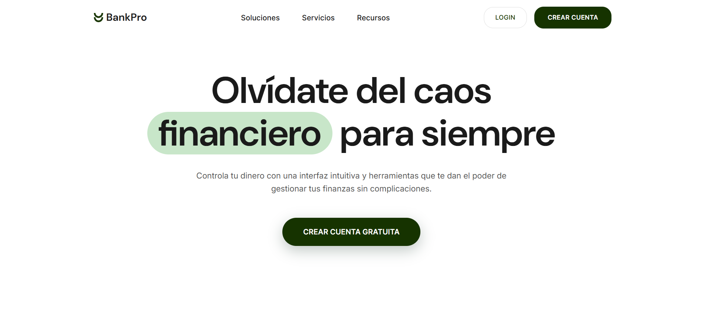

---

### Registro de Usuario

El proceso de registro permite a nuevos usuarios crear una cuenta en la aplicación.

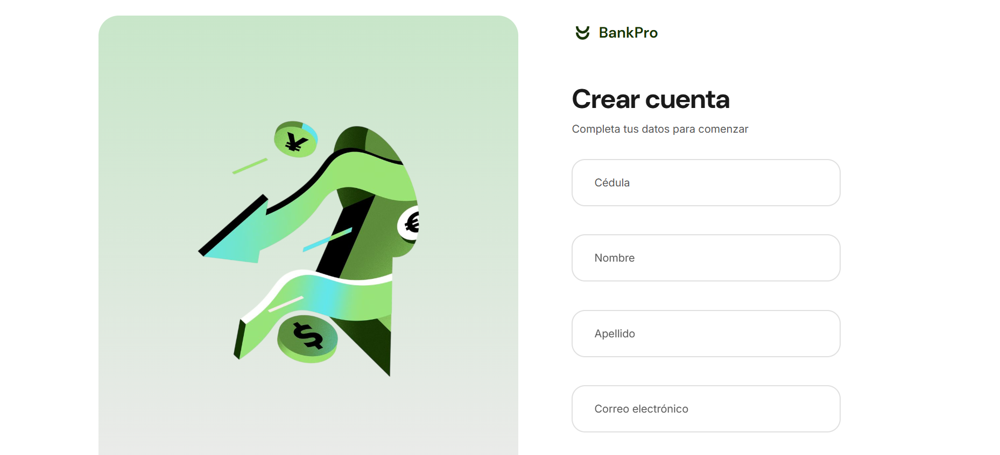 


### Inicio de Sesión

Sistema de autenticación con validación de credenciales y gestión de sesiones.

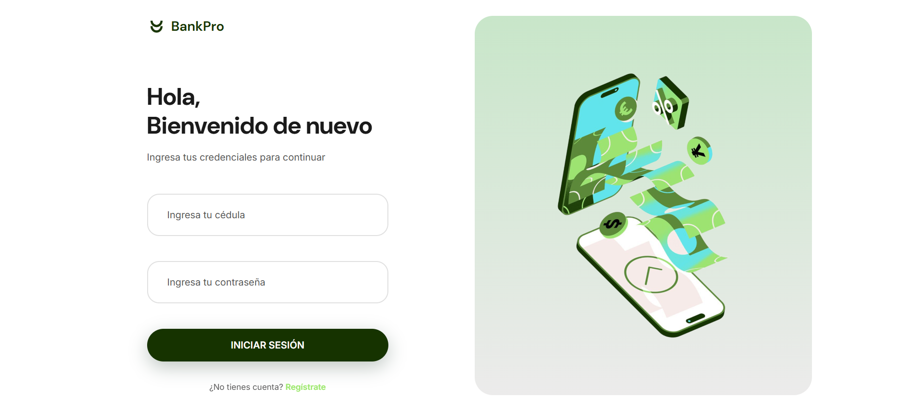

---

### Panel de Control (Overview)

El dashboard proporciona una vista general de la cuenta del usuario, mostrando el saldo total y un resumen de las transacciones recientes.

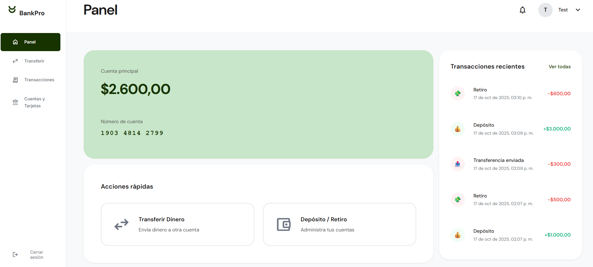


**Elementos del Overview:**
- Saldo total de cuenta principal
- Transacciones recientes
- Acceso rápido a funcionalidades principales

---

### Transferencias

Sistema de transferencias entre cuentas con validación de saldos y confirmación de operaciones.

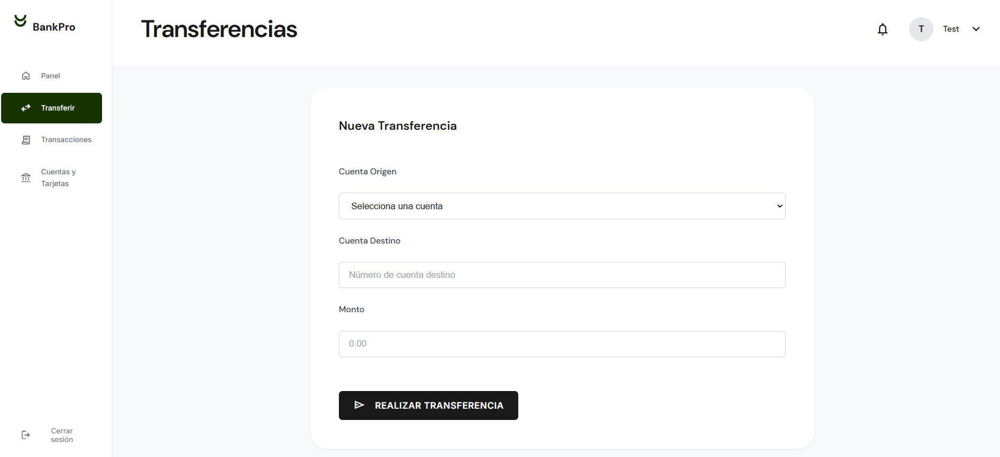 
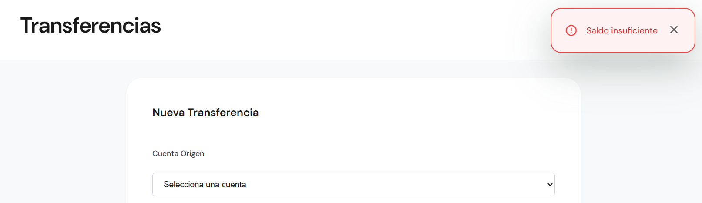 
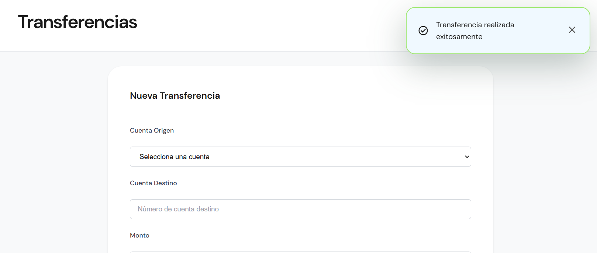 

**Proceso de transferencia:**
1. Selección de cuenta de origen
2. Ingreso del número de cuenta destino
3. Especificación del monto
4. Validación de saldo disponible
5. Confirmación de la operación
6. Actualización automática de saldos

---

### Gestión de Cuentas

Administración completa de cuentas bancarias con múltiples operaciones disponibles.

#### Lista de Cuentas

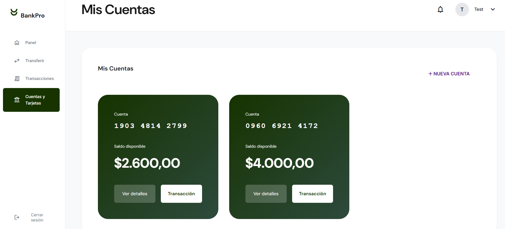

#### Crear Nueva Cuenta

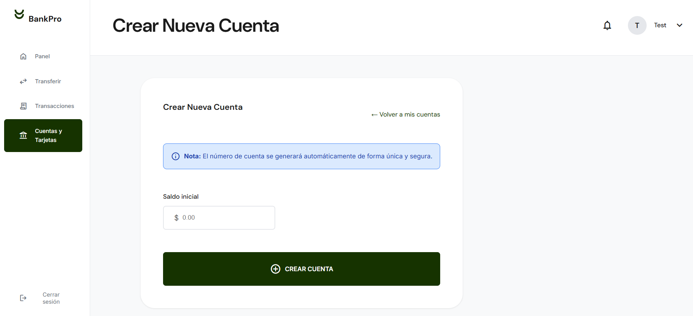

#### Detallles Cuenta
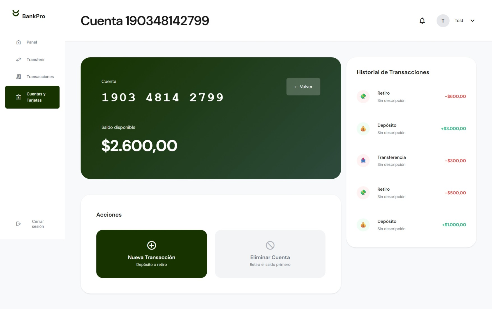 

#### Depositar/Retirar Dinero

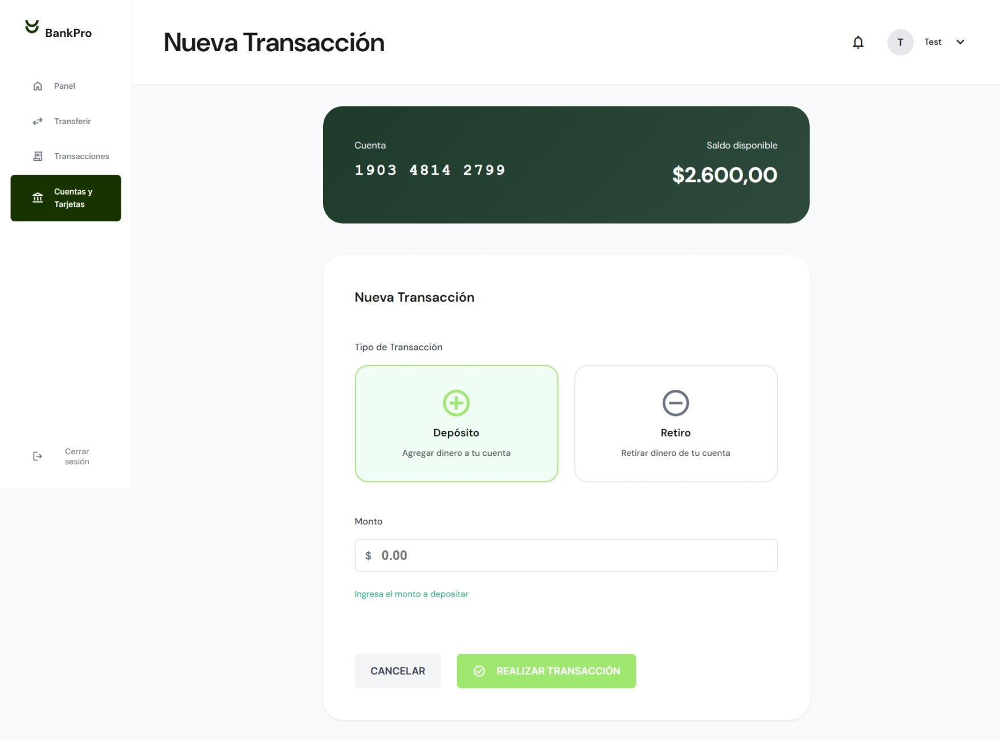 

**Pasos para depositar:**
1. Seleccionar la cuenta
2. Ingresar el monto a depositar
3. Confirmar la operación
4. Ver el saldo actualizado

---

### Historial de Transacciones

Vista detallada de todas las transacciones realizadas en una cuenta específica.

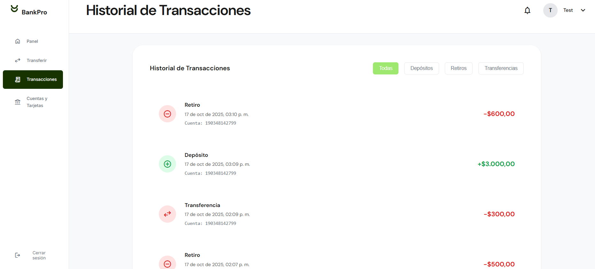


**Información mostrada:**
- Fecha y hora de la transacción
- Monto de la operación
- Tipo de transacción (depósito, retiro, transferencia)
- Cuenta de origen
